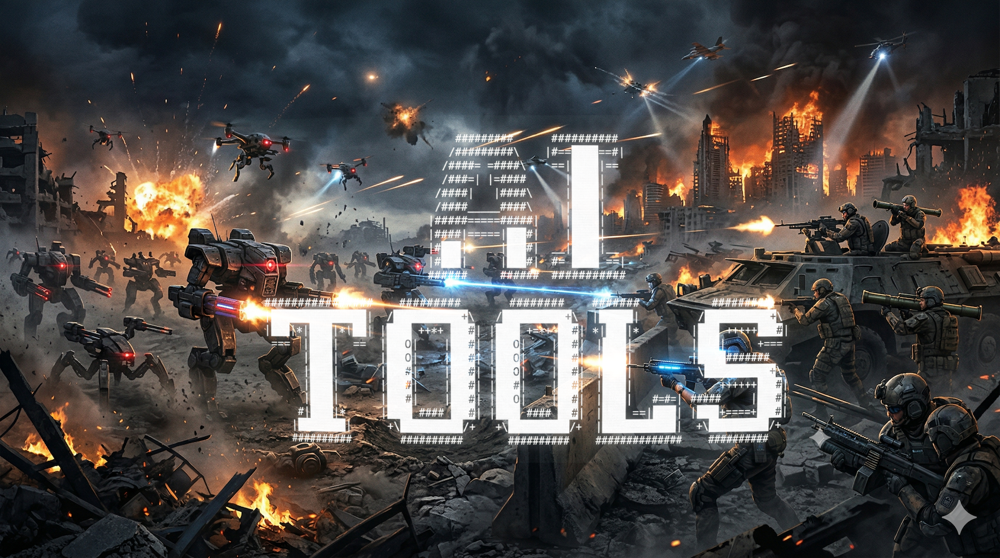

# AI Toolkit



A personal library of reusable AI assets — prompt templates, Claude Code skills, and subagent definitions — designed to be version-controlled, portable, and ready to drop into any project.

## Why This Exists

Working with AI tools means accumulating a growing collection of prompts, behavioural instructions, and agent configurations. Rather than scattering these across Notion pages, project folders, and chat histories, this repo serves as a single source of truth — markdown files in Git, diffable and shareable.

## Structure

```
ai-toolkit/
├── prompts/
│   ├── README.md
│   └── ...
├── skills/
│   ├── README.md
│   └── ...
└── agents/
    ├── README.md
    └── ...
```

### `/prompts`

Standalone instructions you paste into a conversation. No special tooling, no memory — text in, text out.

Each prompt is a single `.md` file with a brief description at the top and the prompt body below.

### `/skills`

Structured instructions that define how Claude should behave across a task. These go beyond a one-shot prompt — they include rules about tools, output formats, step sequences, and edge case handling.

Skills can be used as Claude Project instructions, `SKILL.md` files in Claude Code, or referenced inline during a conversation.

### `/agents`

Claude Code subagent definitions. Each file follows the standard `.md` format with YAML frontmatter specifying name, description, model, and tool access.

Drop these into `.claude/agents/` (project-level) or `~/.claude/agents/` (global) and Claude Code will delegate matching tasks to them automatically.

```yaml
---
name: example-agent
description: When this agent should be invoked
tools: Read, Grep, Glob
model: sonnet
---
You are a specialist in [domain]. Your job is to...
```

## Usage

**With Claude Code** — clone the repo, symlink or copy the agents and skills you need into your project's `.claude/agents/` or reference them directly.

**As reference** — browse the prompts and copy what you need into any Claude conversation, project, or tool.

**Contributing to your own fork** — add new assets, refine existing ones, and track changes over time with standard Git workflows.

## Conventions

- One asset per file
- Filenames use `kebab-case.md`
- Each file starts with a brief comment describing what it does and when to use it
- Subagent files include YAML frontmatter following the [Claude Code subagent spec](https://code.claude.com/docs/en/sub-agents)
- Prompts and skills use plain markdown with no frontmatter unless metadata is needed

## License

MIT
